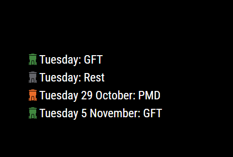

# MMM-DenHaag-TrashCalendar
A simple module for MagicMirror2 designed to show when your trash will be collected by the Den Haag trash collection service.  This module only works if you can find your address in this website: https://huisvuilkalender.denhaag.nl/. 

This module is build on [MMM-ROVA-trashcalendar by jeroenpeters1986](https://github.com/jeroenpeters1986/MMM-ROVA-trashcalendar). I adapted the existing module to serve for the Den Haag area.

## Dependencies
  * A [MagicMirror<sup>2</sup>](https://github.com/MichMich/MagicMirror) installation

## Installation

In your terminal, go to your MagicMirror's Module folder:
````
cd ~/MagicMirror/modules
````

Clone this repository and install the dependencies:
````
git clone https://github.com/cokceken/MMM-DenHaag-TrashCalendar.git
````

Add the module to the modules array in the `config/config.js` file, insert your own postal code and housenumber as following:

```
    {
        module: "MMM-DenHaag-TrashCalendar",
        position: "bottom_left",
        config: {
            zipCode: "2513AA",
            houseNr: 1,
            dateFormat: "dddd D MMMM",
            numberOfItems: 4
        }
    }
```

## Sample screenshot


## Config Definition
| **Option** | **Description** |
| --- | --- |
| `zipCode` | Zipcode without empty space. Example: `2513AA` |
| `houseNr` | House number as an integer |
| `dateFormat` | Any date format compliant to the [date format standart](https://tc39.es/ecma262/multipage/numbers-and-dates.html#sec-date-time-string-format). Example: "dddd D MMMM" |
| `numberOfItems` | Number of items to show in the list as an integer |
| `updateInterval` | Time to update the next pickup dates, in milliseconds. Default value is 14.400.000(4 hours) |